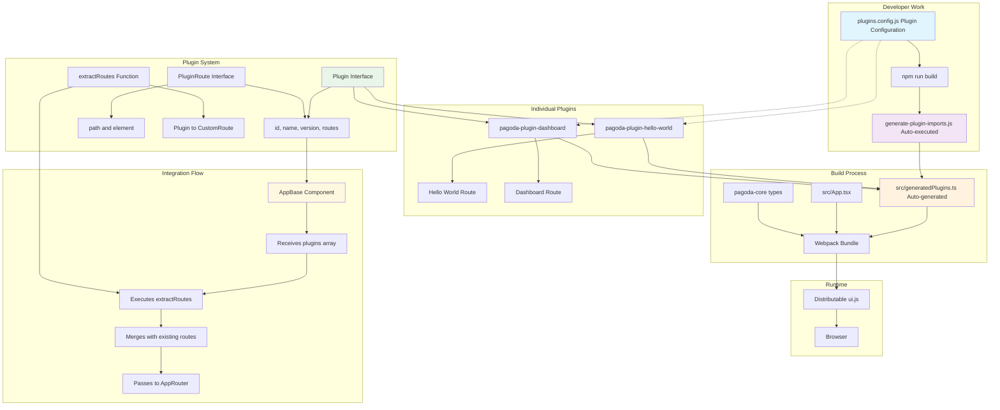

# Airone Plugin Development Guide

This guide explains how to create, develop, and distribute plugins for the Airone frontend using the new simplified plugin architecture.

## 🎯 Overview

Airone uses an **extremely simplified plugin system** that focuses on the core principle: **"just connecting routing with React Components"**. This eliminates complex lifecycle management, API layers, and dependency systems in favor of a minimal, type-safe approach.

## 🏗️ Simplified Plugin Architecture

### Plugin System Architecture



### Key Principles

1. **Extreme Simplification**: Plugin interface contains only `id`, `name`, `version`, and `routes`
2. **No Lifecycle Management**: Removed initialize, activate, deactivate hooks
3. **No Plugin API**: Direct component implementation without API layers
4. **Configuration-Based**: Managed through `plugins.config.js` only
5. **Type Safety**: Enforced using TypeScript's `satisfies` operator

## 🚀 Getting Started

### 1. Prerequisites

- Node.js 18+ and npm 8+
- TypeScript 5.0+
- Basic knowledge of React and TypeScript
- Understanding of npm package development and local linking

### 2. Manual Setup

Create a new plugin directory:

```bash
mkdir pagoda-plugin-my-feature
cd pagoda-plugin-my-feature
npm init -y
```

Install peer dependencies:
```bash
npm install --save-peer @dmm-com/pagoda-core react react-dom @mui/material @mui/icons-material
npm install --save-dev @types/react @types/react-dom typescript
```

Configure TypeScript:
```json
// tsconfig.json
{
  "compilerOptions": {
    "target": "ES2020",
    "module": "CommonJS",
    "lib": ["ES2020", "DOM"],
    "declaration": true,
    "outDir": "./dist",
    "strict": true,
    "esModuleInterop": true,
    "jsx": "react-jsx"
  },
  "include": ["src/**/*"],
  "exclude": ["node_modules", "dist"]
}
```

## 📋 Simplified Plugin Structure

### Plugin Interface (Simplified)

```typescript
// Provided by @dmm-com/pagoda-core
export interface Plugin {
  id: string;                    // Unique identifier
  name: string;                  // Display name
  version: string;               // Semver version
  routes: PluginRoute[];         // Route definitions
}

export interface PluginRoute {
  path: string;                  // Route path (recommend /ui/ prefix)
  element: ReactNode;            // React component element
}
```

### Route Configuration

- **Simple**: Only path and element required
- **Type Safe**: Use `satisfies Plugin` for compile-time validation
- **No Complexity**: No lifecycle hooks, priorities, or API dependencies

### Basic Plugin Example

```typescript
// src/index.ts
import React from "react";
import type { Plugin } from "@dmm-com/pagoda-core";
import MyPluginPage from "./components/MyPluginPage";

const myPlugin = {
  id: "my-awesome-plugin",
  name: "My Awesome Plugin",
  version: "1.0.0",
  routes: [
    {
      path: "/ui/my-plugin",
      element: React.createElement(MyPluginPage),
    },
  ],
} satisfies Plugin; // Type safety enforcement

export default myPlugin;
```

### Component Implementation

```typescript
// src/components/MyPluginPage.tsx
import React, { useState } from "react";
import { Box, Typography, Card, CardContent, Button } from "@mui/material";

// Optional: Plugin API integration (passed as props if available)
export interface MyPluginPageProps {
  pluginAPI?: {
    ui?: { showNotification?: (message: string, type: string) => void };
    routing?: { navigate?: (path: string) => void };
  };
}

const MyPluginPage: React.FC<MyPluginPageProps> = ({ pluginAPI }) => {
  const [count, setCount] = useState(0);

  const handleClick = () => {
    setCount(prev => prev + 1);
    
    // Optional: Use plugin API if available
    if (pluginAPI?.ui?.showNotification) {
      pluginAPI.ui.showNotification(`Clicked ${count + 1} times!`, "success");
    }
  };

  return (
    <Box sx={{ p: 3 }}>
      <Typography variant="h4" gutterBottom>
        My Awesome Plugin
      </Typography>
      
      <Card>
        <CardContent>
          <Typography variant="body1" paragraph>
            This is a demonstration of the simplified plugin system.
          </Typography>
          
          <Button variant="contained" onClick={handleClick}>
            Click Me ({count})
          </Button>
        </CardContent>
      </Card>
    </Box>
  );
};

export default MyPluginPage;
```

## 🎨 Development Guidelines

### Naming Conventions

1. **Package Name**: Use `pagoda-plugin-` prefix
   - ✅ `pagoda-plugin-reports`
   - ✅ `pagoda-plugin-user-management`
   - ❌ `my-pagoda-plugin`

2. **Plugin ID**: Use kebab-case
   - ✅ `reports-dashboard`
   - ✅ `user-management`
   - ❌ `ReportsDashboard`

3. **Routes**: Use descriptive paths with `/ui/` prefix
   - ✅ `/ui/reports/dashboard`
   - ✅ `/ui/user-management/settings`
   - ❌ `/reports` (missing /ui/ prefix)

### Integration with pagoda-minimal-builder

1. **Add to plugins.config.js**:
   ```javascript
   // plugins.config.js
   export default {
     plugins: [
       "pagoda-plugin-hello-world",
       "pagoda-plugin-dashboard",
       "pagoda-plugin-your-plugin", // Add here
     ],
   };
   ```

2. **Install locally for development**:
   ```bash
   # In pagoda-minimal-builder directory
   npm link ../path/to/your-plugin
   npm run build
   npm run start
   ```

3. **Verify integration**:
   - Check browser console for loading messages
   - Navigate to your plugin's route
   - Verify component renders correctly

### Component Development Best Practices

- Use React functional components with TypeScript
- Export component interfaces for type safety
- Follow Material-UI design patterns
- Implement responsive design
- Handle optional pluginAPI props gracefully

### Package.json Configuration

```json
{
  "name": "pagoda-plugin-my-feature",
  "version": "1.0.0",
  "main": "dist/index.js",
  "types": "dist/index.d.ts",
  "files": ["dist", "src"],
  "scripts": {
    "build": "tsc",
    "typecheck": "tsc --noEmit",
    "clean": "rm -rf dist"
  },
  "peerDependencies": {
    "@dmm-com/pagoda-core": "^1.1.0",
    "react": "^18.0.0",
    "react-dom": "^18.0.0",
    "@mui/material": "^6.0.0",
    "@mui/icons-material": "^6.0.0"
  },
  "devDependencies": {
    "@types/react": "^18.0.0",
    "@types/react-dom": "^18.0.0",
    "typescript": "^5.0.0"
  }
}
```

## 🔧 Plugin Features

### Multi-Route Plugins

Support multiple pages within a single plugin:

```typescript
const myPlugin = {
  id: "my-multi-page-plugin",
  name: "My Multi-Page Plugin",
  version: "1.0.0",
  routes: [
    {
      path: "/ui/my-plugin",
      element: React.createElement(DashboardPage)
    },
    {
      path: "/ui/my-plugin/settings",
      element: React.createElement(SettingsPage)
    },
    {
      path: "/ui/my-plugin/reports",
      element: React.createElement(ReportsPage)
    }
  ],
} satisfies Plugin;
```

### Route Overrides

Override existing application routes:

```typescript
// Override the default dashboard
const dashboardPlugin = {
  id: "enhanced-dashboard",
  name: "Enhanced Dashboard",
  version: "1.0.0",
  routes: [
    {
      path: "/ui/dashboard", // Override existing dashboard
      element: React.createElement(EnhancedDashboard)
    }
  ],
} satisfies Plugin;
```

### State Management

Use React Context for plugin-wide state:

```typescript
import React, { createContext, useContext, useState } from 'react';

interface PluginState {
  isLoaded: boolean;
  data: any[];
}

const PluginContext = createContext<PluginState | null>(null);

export const PluginProvider: React.FC<{children: React.ReactNode}> = ({children}) => {
  const [state, setState] = useState<PluginState>({
    isLoaded: false,
    data: []
  });

  return (
    <PluginContext.Provider value={state}>
      {children}
    </PluginContext.Provider>
  );
};

export const usePluginState = () => {
  const context = useContext(PluginContext);
  if (!context) throw new Error('usePluginState must be used within PluginProvider');
  return context;
};
```

## 🏗️ Building and Testing

### Local Development

```bash
# Build TypeScript
npm run build

# Type checking only
npm run typecheck

# Clean build artifacts
npm run clean
```

### Local Testing with pagoda-minimal-builder

1. **Using npm link** (recommended):
   ```bash
   # In your plugin directory
   npm run build
   npm link
   
   # In pagoda-minimal-builder directory
   npm link pagoda-plugin-your-name
   ```

2. **Add to plugins.config.js**:
   ```javascript
   export default {
     plugins: [
       "pagoda-plugin-hello-world",
       "pagoda-plugin-your-name", // Your plugin
     ],
   };
   ```

3. **Test integration**:
   ```bash
   # In pagoda-minimal-builder directory
   npm run build
   npm run start
   ```

### Integration Testing

Verify your plugin works correctly:
1. Check browser console for loading messages
2. Navigate to plugin routes in browser
3. Test component functionality
4. Verify TypeScript compilation without errors

## 📦 Distribution

### Local Distribution

For local/internal use:
1. Build your plugin with `npm run build`
2. Use `npm link` for development testing
3. Use `npm pack` to create distributable package

### Publishing to npm (Optional)

For public distribution:

```bash
# Ensure proper configuration
npm run build

# Version your plugin
npm version patch  # or minor/major

# Publish (if public)
npm publish
```

### Installation by Users

Users can install your plugin in their pagoda-minimal-builder:

```bash
# Install the plugin
npm install pagoda-plugin-your-name

# Add to plugins.config.js
# Then run build
npm run build
```

## 🐛 Troubleshooting

### Common Issues

#### Plugin Not Loading
- **Check naming**: Ensure package name starts with `pagoda-plugin-`
- **Verify export**: Plugin should be default export
- **Check plugins.config.js**: Ensure plugin is listed in configuration
- **Verify build**: Check `src/generatedPlugins.ts` was auto-generated

#### TypeScript Errors
- **Install peer dependencies**: Make sure all peer deps are available
- **Check imports**: Verify `import type { Plugin } from "@dmm-com/pagoda-core"`
- **Use satisfies**: Ensure you use `satisfies Plugin` syntax
- **Update types**: Use compatible versions of dependencies

#### Runtime Errors
- **Check console**: Look for error messages in browser console
- **Verify imports**: Ensure all imported modules are available
- **Test components**: Test React components independently
- **Check paths**: Verify route paths are accessible

#### Routes Not Working
- **Path format**: Ensure paths start with `/ui/`
- **React.createElement**: Verify proper component element creation
- **Component export**: Ensure components are properly exported

### Debug Tips

Add logging to your plugin:

```typescript
const myPlugin = {
  id: "my-plugin",
  name: "My Plugin",
  version: "1.0.0",
  routes: [
    {
      path: "/ui/my-plugin",
      element: React.createElement(() => {
        console.log('[MyPlugin] Component rendering');
        return React.createElement('div', {}, 'Hello from My Plugin!');
      }),
    },
  ],
} satisfies Plugin;

console.log('[MyPlugin] Plugin defined:', myPlugin);
export default myPlugin;
```

## 🎯 Best Practices

### Development
1. **Use TypeScript**: Ensure type safety with `satisfies Plugin`
2. **Export interfaces**: Export component prop interfaces for type safety  
3. **Handle errors gracefully**: Wrap components in error boundaries
4. **Consistent naming**: Follow kebab-case for IDs and paths
5. **Documentation**: Comment your plugin code clearly

### Performance  
1. **Lazy loading**: Use dynamic imports for heavy components
2. **React.memo**: Use memoization for expensive components
3. **Minimize bundle**: Keep dependencies lean
4. **Optimize images**: Use appropriate image formats and sizes

### Accessibility
1. **Semantic HTML**: Use proper HTML elements
2. **Keyboard navigation**: Ensure all interactive elements are keyboard accessible
3. **Screen readers**: Provide proper ARIA labels and descriptions
4. **Color contrast**: Follow WCAG guidelines for color contrast

## 📚 Examples

### Minimal Plugin

```typescript
import React from "react";
import type { Plugin } from "@dmm-com/pagoda-core";

const minimalPlugin = {
  id: "minimal-plugin",
  name: "Minimal Plugin",
  version: "1.0.0",
  routes: [
    {
      path: "/ui/minimal",
      element: React.createElement('div', { style: { padding: '20px' } }, 
        React.createElement('h1', {}, 'Minimal Plugin'),
        React.createElement('p', {}, 'This is the simplest possible plugin.')
      )
    }
  ],
} satisfies Plugin;

export default minimalPlugin;
```

### Feature-Rich Plugin

```typescript
import React from "react";
import type { Plugin } from "@dmm-com/pagoda-core";
import DashboardPage from "./components/DashboardPage";
import SettingsPage from "./components/SettingsPage";
import ReportsPage from "./components/ReportsPage";

const analyticsPlugin = {
  id: "analytics-plugin",
  name: "Analytics Plugin",
  version: "1.2.0",
  routes: [
    {
      path: "/ui/analytics",
      element: React.createElement(DashboardPage)
    },
    {
      path: "/ui/analytics/settings",
      element: React.createElement(SettingsPage)
    },
    {
      path: "/ui/analytics/reports",
      element: React.createElement(ReportsPage)
    }
  ],
} satisfies Plugin;

export default analyticsPlugin;
```

## 🔄 Changes from Legacy System

### Removed Features
- ❌ **ExternalPluginLoader**: No automatic plugin discovery
- ❌ **Plugin API**: No centralized API access  
- ❌ **Lifecycle hooks**: No initialize/activate/deactivate methods
- ❌ **Priority system**: No plugin loading priorities
- ❌ **Dependency management**: No plugin dependencies
- ❌ **Configuration options**: No complex plugin configuration

### New Approach
- ✅ **Configuration-based**: Managed through `plugins.config.js`
- ✅ **Type safety**: Enforced with `satisfies Plugin`
- ✅ **Direct integration**: Components directly rendered in routes
- ✅ **Simplicity**: Minimal interface with maximum flexibility
- ✅ **Build-time resolution**: Static import generation at build time

## 📞 Support

### Getting Help

1. **Documentation**: Refer to this guide and existing plugin examples
2. **Code inspection**: Study `pagoda-plugin-hello-world` and `pagoda-plugin-dashboard`
3. **Console debugging**: Use browser developer tools for troubleshooting
4. **Community**: Engage with the development community for support

### Contributing

1. **Plugin examples**: Share your plugin implementations
2. **Documentation improvements**: Help enhance this guide  
3. **Best practices**: Contribute development patterns and practices
4. **Core system**: Suggest improvements to the plugin architecture

## 🚀 Using pagoda-minimal-builder

The `pagoda-minimal-builder` provides a complete integration environment for testing and deploying plugins.

### Quick Start

1. **Navigate to pagoda-minimal-builder**:
   ```bash
   cd /path/to/airone/frontend/plugins/pagoda-minimal-builder
   ```

2. **Install dependencies**:
   ```bash
   npm install
   ```

3. **Start development server**:
   ```bash
   npm run start
   ```

4. **Access in browser**:
   - Main app: http://localhost:3000
   - Hello World Plugin: http://localhost:3000/ui/hello-world  
   - Dashboard Plugin: http://localhost:3000/ui/dashboard

### Files Structure

```
pagoda-minimal-builder/
├── src/
│   ├── App.tsx                    # Main application entry
│   └── generatedPlugins.ts       # Auto-generated plugin imports
├── scripts/
│   └── generate-plugin-imports.js # Import generator
├── plugins.config.js             # Plugin configuration  
├── webpack.config.js             # Build configuration
├── package.json                  # Dependencies and scripts
└── README.md                     # Usage documentation
```

### How the Build Process Works

1. **Configuration**: Edit `plugins.config.js` to specify plugins
2. **Auto-generation**: `npm run build` triggers `generate-plugin-imports.js`
3. **Static imports**: `src/generatedPlugins.ts` is created with import statements
4. **Bundle creation**: Webpack creates `dist/ui.js` with all plugins included
5. **No source editing**: Add/remove plugins by configuration only

### Development Workflow

1. **Create your plugin** following the guidelines above
2. **Link locally**: Use `npm link` for development testing
3. **Configure**: Add plugin name to `plugins.config.js` 
4. **Build & test**: Run `npm run build && npm run start`
5. **Debug**: Check console logs and browser developer tools
6. **Deploy**: Use generated `dist/ui.js` for production

---

This simplified plugin system prioritizes ease of use and maintainability. The focus is on connecting React components to routes with minimal complexity, allowing developers to build powerful extensions without dealing with complex plugin lifecycles or APIs.