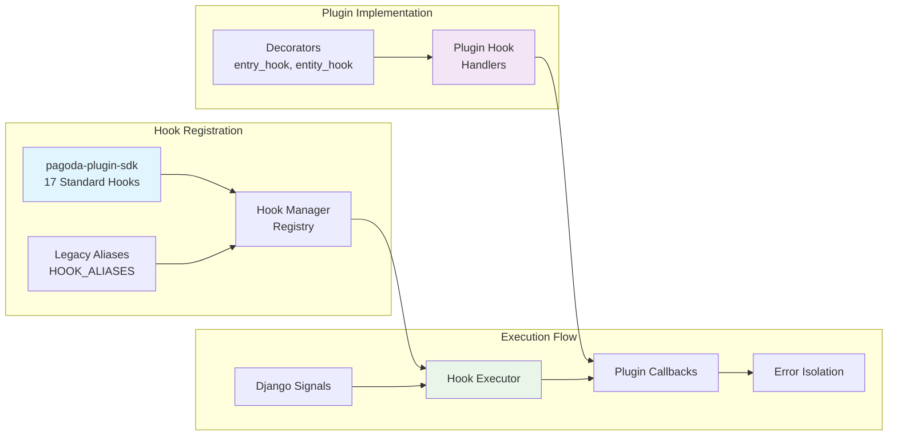
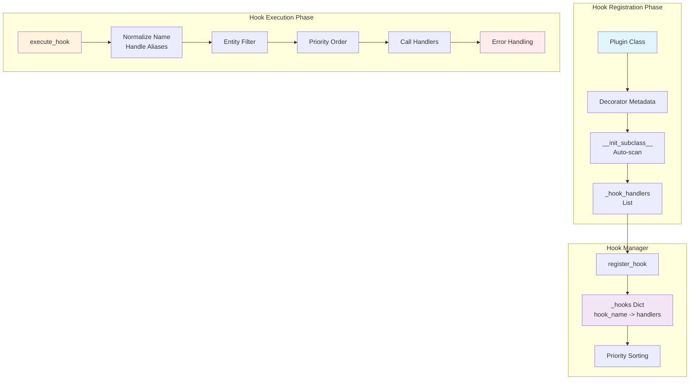
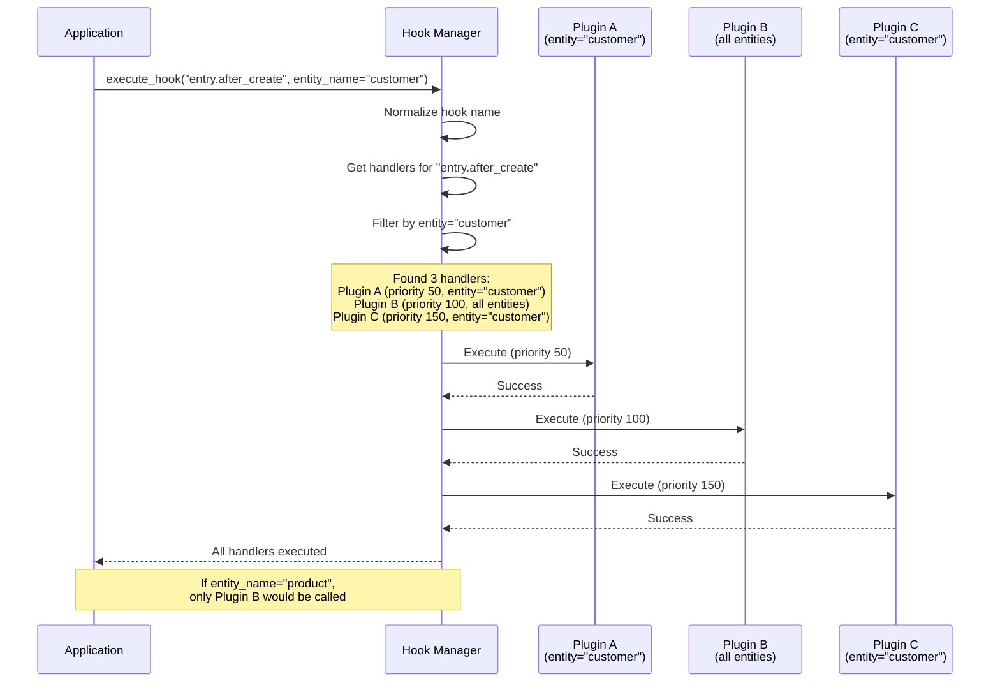
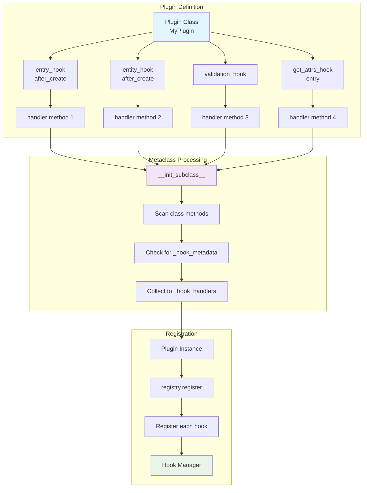
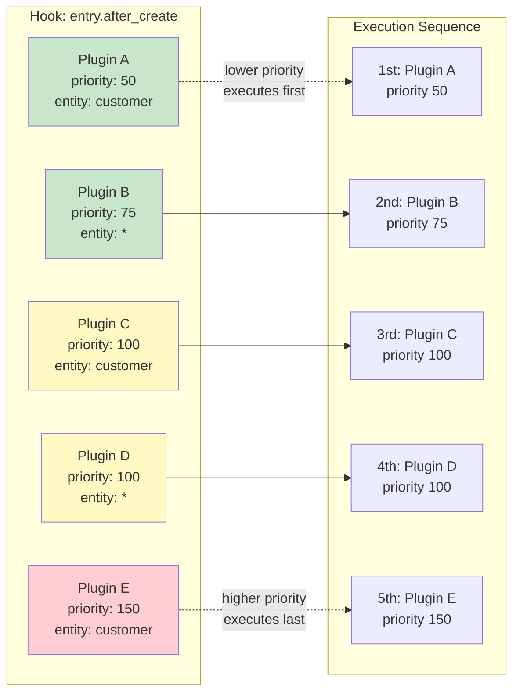
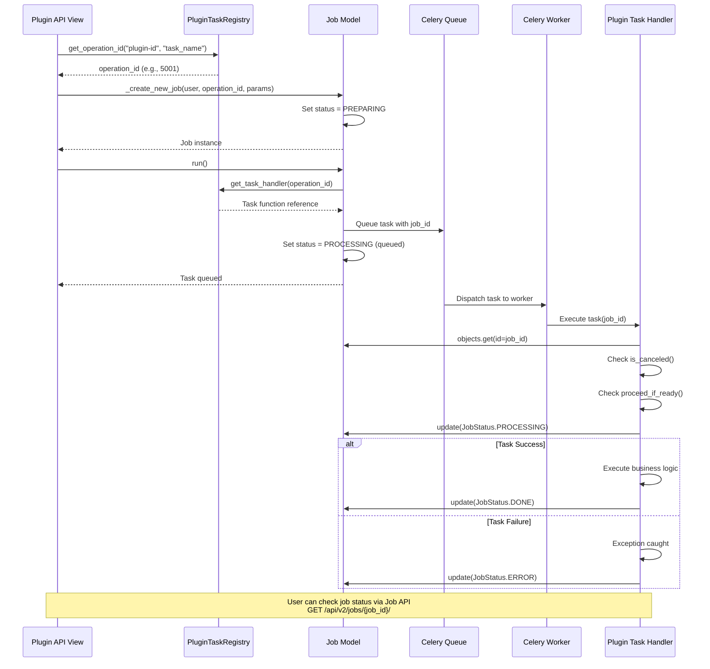
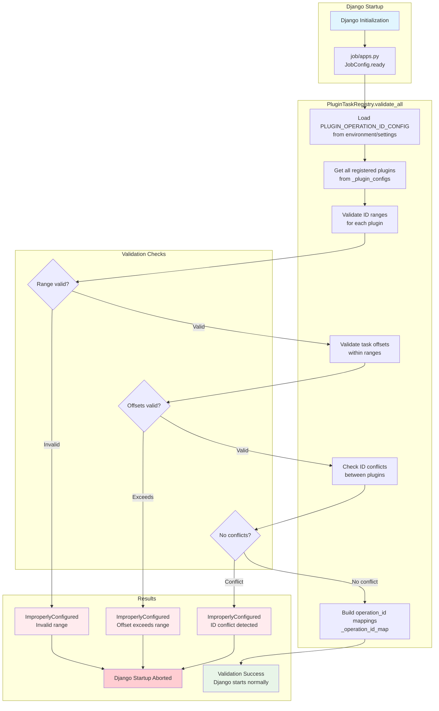
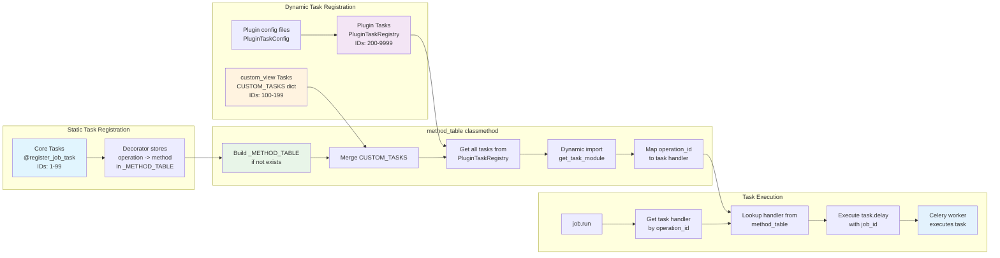

## System Architecture Overview

### 3-Layer Architecture Flow

### Plugin Discovery & Registration Flow

### Hook System Architecture

### Hook Manager Detailed Architecture

### Hook Execution Flow with Entity Filtering

### Decorator-Based Hook Registration

### Priority-Based Execution Order

### API Integration Architecture

## Plugin Development Lifecycle

### Development Phase Architecture

### Runtime Architecture

## Data Flow Diagrams

### Plugin API Request Flow

### Plugin Hook Execution Flow

### Plugin Job Task Execution Flow

### Plugin Operation ID Validation Flow

### Job Model method_table Architecture

## Error Handling & Recovery

### Plugin Error Isolation

### Plugin System Health Check

## Security Architecture

### Plugin Security Boundaries

Through this 3-layer architecture design with Protocol-based model injection, Pagoda provides a completely independent plugin ecosystem, realizing a secure and extensible platform. Plugin developers can provide unique value while accessing Pagoda's core models through type-safe Protocol definitions, without creating implementation dependencies.