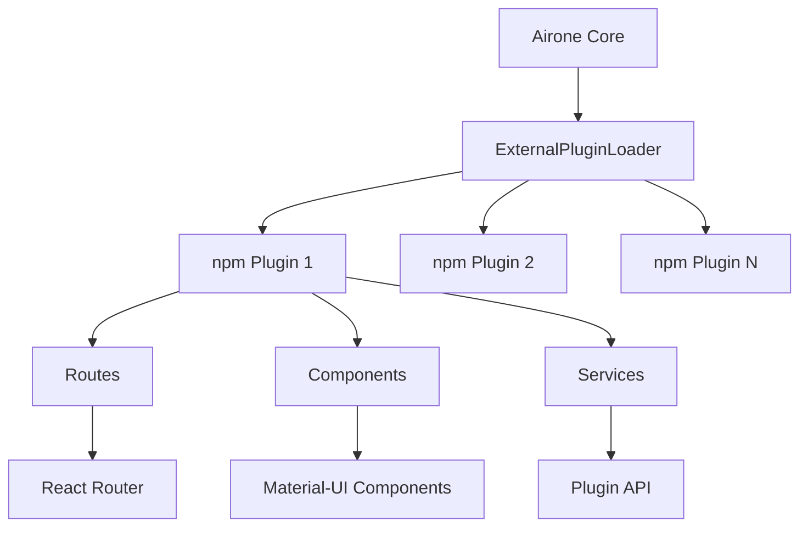

# Airone Plugin Development Guide

This guide explains how to create, develop, and publish external plugins for Airone as independent npm modules.

## 🎯 Overview

Airone supports external plugins as npm modules that can be developed, published, and installed independently from the main Airone codebase. This allows developers to extend Airone functionality without needing access to the main repository.

## 🏗️ Plugin Architecture

### Plugin System Architecture



### Key Components

1. **ExternalPluginLoader**: Discovers and loads external npm plugins
2. **Plugin Interface**: Defines the structure and lifecycle of plugins
3. **Route System**: Integrates plugin routes with React Router
4. **Plugin API**: Provides access to core Airone functionality

## 🚀 Getting Started

### 1. Prerequisites

- Node.js 18+ and npm 8+
- TypeScript 5.8+
- Basic knowledge of React and TypeScript
- Understanding of npm package development

### 2. Using the Plugin Template

The easiest way to start is with the official template:

```bash
# Clone the template (replace with actual template repo)
git clone https://github.com/dmm-com/airone-plugin-template my-plugin
cd my-plugin

# Install dependencies
npm install

# Start development
npm run dev
```

### 3. Manual Setup

If you prefer to set up manually:

```bash
mkdir airone-plugin-my-feature
cd airone-plugin-my-feature
npm init -y
```

Install peer dependencies:
```bash
npm install --save-peer @dmm-com/pagoda-core react @mui/material
npm install --save-dev @types/react typescript
```

## 📋 Plugin Structure

### Required Plugin Interface

```typescript
export interface Plugin {
  // Required fields
  id: string;           // Unique identifier
  name: string;         // Display name
  version: string;      // Semver version

  // Optional fields
  description?: string; // Plugin description
  author?: string;      // Author name
  priority?: number;    // Load priority (default: 0)
  
  // Plugin functionality
  routes?: PluginRoute[];              // UI routes
  initialize?: (api: PluginAPI) => Promise<void> | void;
  activate?: () => void;               // Activation hook
  deactivate?: () => void;             // Deactivation hook
}
```

### Route Configuration

```typescript
export interface PluginRoute {
  path: string;           // Must start with '/ui/'
  element: ReactElement;  // React component
  priority?: number;      // Route priority (default: 0)
  override?: boolean;     // Can override existing routes
  layout?: 'default' | 'minimal' | 'fullscreen';
}
```

### Basic Plugin Example

```typescript
// src/index.ts
import React from 'react';
import { Plugin } from '@dmm-com/pagoda-core/plugins';
import { MyPluginPage } from './components/MyPluginPage';

const plugin: Plugin = {
  id: 'my-awesome-plugin',
  name: 'My Awesome Plugin',
  version: '1.0.0',
  description: 'A plugin that does awesome things',
  author: 'Your Name',
  priority: 1000,

  routes: [
    {
      path: '/ui/my-plugin',
      element: React.createElement(MyPluginPage),
      priority: 1000,
      layout: 'default'
    }
  ],

  initialize: async (api) => {
    console.log('[MyPlugin] Initializing...');
    // Initialize plugin state, register services, etc.
  },

  activate: () => {
    console.log('[MyPlugin] Activated');
  },

  deactivate: () => {
    console.log('[MyPlugin] Deactivated');
  }
};

export default plugin;
```

## 🎨 Development Guidelines

### Naming Conventions

1. **Package Name**: Use `airone-plugin-` prefix
   - ✅ `airone-plugin-reports`
   - ✅ `airone-plugin-user-management`
   - ❌ `my-airone-plugin`

2. **Plugin ID**: Use kebab-case
   - ✅ `reports-dashboard`
   - ✅ `user-management`
   - ❌ `ReportsDashboard`

3. **Routes**: Use descriptive paths with `/ui/` prefix
   - ✅ `/ui/reports/dashboard`
   - ✅ `/ui/user-management/settings`
   - ❌ `/reports` (missing /ui/ prefix)

### Component Development

Use React functional components with TypeScript:

```typescript
// src/components/MyPluginPage.tsx
import React, { useState } from 'react';
import { 
  Container, 
  Typography, 
  Paper, 
  Button 
} from '@mui/material';

export const MyPluginPage: React.FC = () => {
  const [count, setCount] = useState(0);

  return (
    <Container maxWidth="lg">
      <Paper sx={{ p: 3 }}>
        <Typography variant="h4" gutterBottom>
          My Plugin Dashboard
        </Typography>
        
        <Button 
          variant="contained" 
          onClick={() => setCount(c => c + 1)}
        >
          Clicked {count} times
        </Button>
      </Paper>
    </Container>
  );
};
```

### TypeScript Configuration

```json
// tsconfig.json
{
  "compilerOptions": {
    "target": "ES2020",
    "module": "CommonJS",
    "lib": ["ES2020", "DOM"],
    "declaration": true,
    "outDir": "./dist",
    "strict": true,
    "esModuleInterop": true,
    "jsx": "react-jsx"
  },
  "include": ["src/**/*"],
  "exclude": ["node_modules", "dist"]
}
```

### Package.json Configuration

```json
{
  "name": "airone-plugin-my-feature",
  "version": "1.0.0",
  "main": "src/index.ts",
  "types": "src/index.ts",
  "scripts": {
    "build": "tsc",
    "dev": "tsc --watch",
    "lint": "eslint src --ext .ts,.tsx"
  },
  "peerDependencies": {
    "@dmm-com/pagoda-core": "^1.1.0",
    "react": "^19.1.1",
    "@mui/material": "^6.0.0"
  },
  "devDependencies": {
    "@types/react": "^18.0.0",
    "typescript": "^5.8.2"
  }
}
```

## 🔧 Advanced Features

### Plugin API Usage

```typescript
// Access core functionality through the API
initialize: async (api: PluginAPI) => {
  // Example API usage (API interface depends on core implementation)
  const currentUser = await api.getCurrentUser();
  const permissions = await api.getUserPermissions(currentUser.id);
  
  console.log(`Plugin initialized for user: ${currentUser.name}`);
}
```

### State Management

```typescript
// Use React Context for plugin state
import React, { createContext, useContext } from 'react';

interface PluginState {
  isLoaded: boolean;
  data: any[];
}

const PluginContext = createContext<PluginState>({
  isLoaded: false,
  data: []
});

export const PluginProvider: React.FC<{children: React.ReactNode}> = ({children}) => {
  // Plugin state logic here
  return (
    <PluginContext.Provider value={state}>
      {children}
    </PluginContext.Provider>
  );
};
```

### Route Overrides

```typescript
// Override existing routes (use carefully)
routes: [
  {
    path: '/ui/entities', // Override core entities page
    element: React.createElement(MyCustomEntitiesPage),
    priority: 2000, // Higher than default
    override: true
  }
]
```

### Multi-Route Plugins

```typescript
// Support multiple pages
routes: [
  {
    path: '/ui/my-plugin',
    element: React.createElement(DashboardPage)
  },
  {
    path: '/ui/my-plugin/settings',
    element: React.createElement(SettingsPage)
  },
  {
    path: '/ui/my-plugin/reports/:id',
    element: React.createElement(ReportDetailPage)
  }
]
```

## 🏗️ Building and Testing

### Local Development

```bash
# Watch mode for development
npm run dev

# Build for production
npm run build

# Lint code
npm run lint

# Run tests (if configured)
npm test
```

### Local Testing with Airone

1. **Using file: dependency**:
   ```bash
   # In Airone project
   npm install file:../path/to/your-plugin
   npm run build
   ```

2. **Using npm link**:
   ```bash
   # In your plugin directory
   npm link
   
   # In Airone project
   npm link airone-plugin-your-name
   npm run build
   ```

### Integration Testing

Test your plugin by:
1. Verifying it loads without errors
2. Checking routes are accessible
3. Testing component functionality
4. Validating plugin lifecycle methods

## 📦 Publishing

### Publishing to npm

```bash
# Ensure you're logged in to npm
npm login

# Version your plugin
npm version patch  # or minor/major

# Publish
npm publish
```

### Installation by Users

After publishing, users can install your plugin:

```bash
# In their Airone project
npm install airone-plugin-your-name

# Update their plugin loader (if needed)
# The plugin should be automatically discovered
```

## ⚙️ Plugin Registration

### Automatic Discovery

Plugins are automatically discovered if they follow the naming convention `airone-plugin-*`. The ExternalPluginLoader will:

1. Scan for packages matching the pattern
2. Require the plugin module
3. Validate the plugin structure
4. Register routes and lifecycle hooks

### Manual Registration

For custom plugin loading, you can modify the ExternalPluginLoader:

```typescript
// In ExternalPluginLoader.ts (for core developers)
private async loadNpmPlugins(): Promise<Plugin[]> {
  const plugins: Plugin[] = [];
  
  // Add your plugin manually
  try {
    const yourPlugin = require('your-plugin-name');
    const plugin = yourPlugin.default || yourPlugin;
    if (this.isValidPlugin(plugin)) {
      plugins.push(plugin);
    }
  } catch (error) {
    console.warn('Failed to load your-plugin-name:', error);
  }
  
  return plugins;
}
```

## 🐛 Troubleshooting

### Common Issues

#### Plugin Not Loading
- **Check naming**: Ensure package name starts with `airone-plugin-`
- **Verify export**: Plugin should be default export
- **Check structure**: Validate plugin matches the required interface

#### TypeScript Errors
- **Install peer dependencies**: Make sure all peer deps are available
- **Check tsconfig**: Ensure TypeScript configuration is compatible
- **Update types**: Use latest type definitions

#### Runtime Errors
- **Check console**: Look for error messages in browser console
- **Verify imports**: Ensure all imported modules are available
- **Test individually**: Test plugin lifecycle methods separately

#### Routes Not Working
- **Path format**: Ensure paths start with `/ui/`
- **Priority conflicts**: Check if route priorities conflict
- **Override settings**: Verify override settings are correct

### Debug Mode

Enable debug logging:

```typescript
initialize: async (api) => {
  console.log('[DEBUG] Plugin initializing with API:', api);
  console.log('[DEBUG] Plugin routes:', plugin.routes);
}
```

## 🎯 Best Practices

### Development
1. **Use TypeScript**: Ensure type safety and better IDE support
2. **Follow conventions**: Use consistent naming and structure
3. **Error handling**: Wrap plugin code in try-catch blocks
4. **Logging**: Use descriptive console messages with plugin prefix
5. **Documentation**: Document your plugin's features and usage

### Performance
1. **Lazy loading**: Use dynamic imports for heavy components
2. **Memoization**: Use React.memo for expensive components
3. **Bundle size**: Minimize dependencies and bundle size
4. **Code splitting**: Split large plugins into chunks

### Security
1. **Input validation**: Validate all user inputs
2. **XSS protection**: Sanitize user content
3. **API usage**: Use provided APIs instead of direct DOM manipulation
4. **Permissions**: Respect user permissions and access controls

### Accessibility
1. **WCAG compliance**: Follow WCAG 2.1 guidelines
2. **Keyboard navigation**: Ensure keyboard accessibility
3. **Screen readers**: Provide proper ARIA labels
4. **Color contrast**: Ensure sufficient color contrast

## 📚 Examples

### Simple Information Plugin

```typescript
// Basic plugin showing system information
const plugin: Plugin = {
  id: 'system-info',
  name: 'System Information',
  version: '1.0.0',
  
  routes: [{
    path: '/ui/system-info',
    element: React.createElement('div', {}, 
      React.createElement('h1', {}, 'System Information'),
      React.createElement('p', {}, `Current time: ${new Date().toISOString()}`)
    )
  }]
};
```

### Complex Dashboard Plugin

```typescript
// Full-featured dashboard plugin
const plugin: Plugin = {
  id: 'analytics-dashboard',
  name: 'Analytics Dashboard',
  version: '2.1.0',
  priority: 1500,
  
  routes: [
    {
      path: '/ui/analytics',
      element: React.createElement(AnalyticsDashboard)
    },
    {
      path: '/ui/analytics/reports',
      element: React.createElement(ReportsPage)
    }
  ],
  
  initialize: async (api) => {
    // Initialize analytics service
    await analyticsService.initialize(api);
  }
};
```

## 🔄 Migration Guide

### From Local Plugins

If migrating from local plugins (frontend/plugins):

1. Create new npm package structure
2. Move components to new project
3. Update imports and exports
4. Configure build system
5. Test independently
6. Publish to npm

### Version Updates

When updating plugins:

1. Follow semantic versioning
2. Document breaking changes
3. Provide migration guides
4. Test with multiple Airone versions

## 📞 Support

### Getting Help

1. **Documentation**: Check this guide and plugin template
2. **Examples**: Study existing plugins for patterns
3. **Issues**: Report bugs via GitHub issues
4. **Community**: Join developer discussions

### Contributing

1. **Template improvements**: Suggest template enhancements
2. **Documentation**: Help improve this guide
3. **Examples**: Share your plugin examples
4. **Core features**: Contribute to plugin system improvements

---

This guide provides a comprehensive foundation for developing Airone plugins. For specific questions or advanced use cases, refer to the plugin template and existing plugin examples.