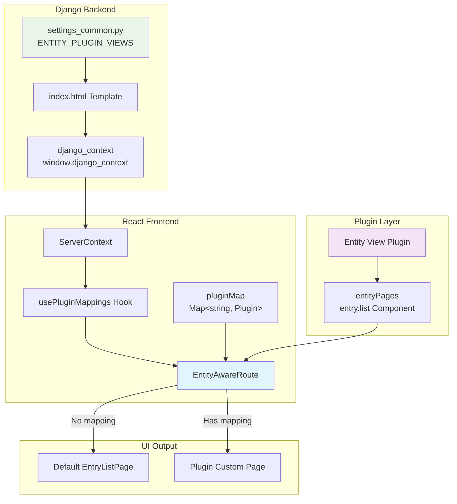
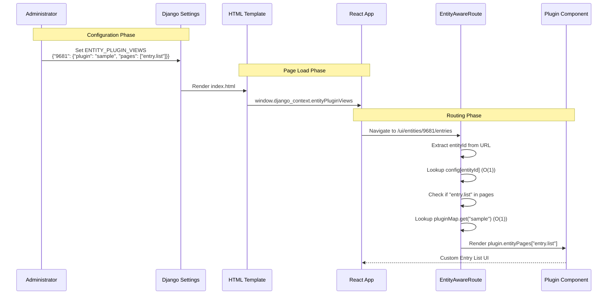
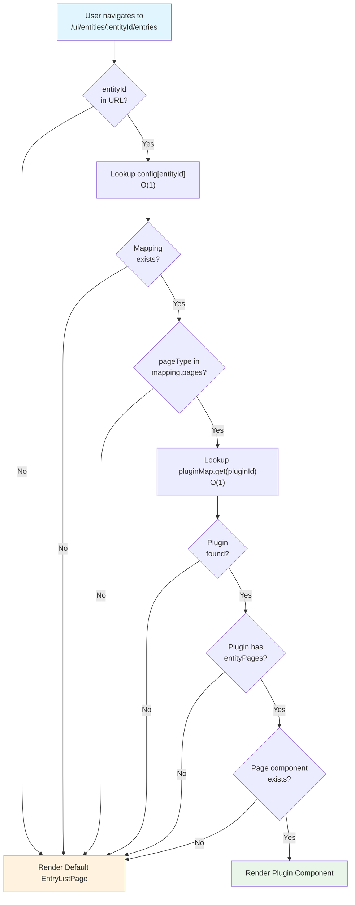

## Overview

Entity-Aware Routing enables **entity-specific UI customization** through the frontend plugin system. This feature allows administrators to configure custom plugin views for specific entities, replacing default Pagoda pages with plugin-provided alternatives.

### Key Benefits

- **Entity-Specific UX**: Different entities can have completely different UI experiences
- **Plugin-Based Customization**: Leverage the plugin ecosystem for UI extensions
- **Zero-Code Configuration**: Switch views via Django settings, no code changes required
- **Graceful Fallback**: Missing plugins or pages automatically fall back to defaults

### Current Scope (Phase 1)

Phase 1 supports:
- **Page Type**: `entry.list` (Entity entries listing page)
- **URL Pattern**: `/ui/entities/:entityId/entries`

Future phases may extend to additional page types such as `entry.detail`, `entry.edit`, etc.

## Architecture

### System Overview



### Data Flow



### Component Relationships

```mermaid
graph LR
    subgraph "App Initialization"
        APP[AppBase]
        PLUGINS[plugins: Plugin[]]
        MAP[pluginMap: Map]
    end

    subgraph "Routing Layer"
        APPROUTER[AppRouter]
        ROUTE[EntityAwareRoute]
    end

    subgraph "Data Sources"
        CTX[ServerContext]
        HOOK[usePluginMappings]
        CONFIG[EntityPluginViewsConfig]
    end

    subgraph "Resolution"
        LOOKUP_ID[config&lsqb;entityId&rsqb;]
        LOOKUP_PLUGIN[pluginMap.get&lpar;pluginId&rpar;]
        COMPONENT[PluginComponent]
    end

    APP --> PLUGINS
    PLUGINS -->|useMemo| MAP
    APP --> APPROUTER
    APPROUTER --> ROUTE
    MAP --> ROUTE

    CTX --> HOOK
    HOOK --> CONFIG
    CONFIG --> ROUTE

    ROUTE --> LOOKUP_ID
    LOOKUP_ID --> LOOKUP_PLUGIN
    LOOKUP_PLUGIN --> COMPONENT

    style APP fill:#e1f5fe
    style ROUTE fill:#f3e5f5
    style COMPONENT fill:#e8f5e8
```

## Configuration

### Django Settings

Configure entity-plugin mappings in `settings_common.py` or via environment variable:

```python
# airone/settings_common.py
AIRONE = {
    # ... other settings ...

    # Frontend plugin entity override configuration
    # Format: { "entityId": { "plugin": "plugin-id", "pages": ["entry.list"] } }
    "FRONTEND_PLUGIN_ENTITY_OVERRIDES": json.loads(
        env.str(
            "FRONTEND_PLUGIN_ENTITY_OVERRIDES",
            json.dumps({}),  # Default: no overrides
        )
    ),
}
```

> **Note**: The configuration key was renamed from `ENTITY_PLUGIN_VIEWS` to `FRONTEND_PLUGIN_ENTITY_OVERRIDES` to clearly distinguish it from backend override configuration (`BACKEND_PLUGIN_ENTITY_OVERRIDES`).

### Configuration Format

```json
{
  "entityId": {
    "plugin": "plugin-id",
    "pages": ["entry.list"]
  }
}
```

| Field | Type | Description |
|-------|------|-------------|
| `entityId` | string | The entity ID (as string) to apply custom routing |
| `plugin` | string | The plugin ID that provides the custom view |
| `pages` | string[] | List of page types to override (currently only `"entry.list"`) |

### Example Configurations

**Single Entity Override:**
```bash
export FRONTEND_PLUGIN_ENTITY_OVERRIDES='{"42": {"plugin": "network-tools", "pages": ["entry.list"]}}'
```

**Multiple Entity Overrides:**
```bash
export FRONTEND_PLUGIN_ENTITY_OVERRIDES='{
  "42": {"plugin": "network-tools", "pages": ["entry.list"]},
  "100": {"plugin": "asset-manager", "pages": ["entry.list"]},
  "255": {"plugin": "custom-dashboard", "pages": ["entry.list"]}
}'
```

**Disable All Overrides:**
```bash
export FRONTEND_PLUGIN_ENTITY_OVERRIDES='{}'
```

## Plugin Development

### Creating an Entity View Plugin

To provide custom entity pages, your plugin must implement the `EntityViewPlugin` interface:

```typescript
import { FC } from "react";

// Plugin interface for entity-specific views
interface EntityViewPlugin {
  id: string;
  name: string;

  // Entity page components by page type
  entityPages?: {
    "entry.list"?: FC;
    // Future: "entry.detail"?, "entry.edit"?, etc.
  };
}
```

### Example Plugin Implementation

```typescript
// plugin-sample/src/index.ts
import { FC } from "react";
import { CustomEntryList } from "./components/CustomEntryList";

interface Plugin {
  id: string;
  name: string;
  entityPages?: {
    "entry.list"?: FC;
  };
}

const plugin: Plugin = {
  id: "sample",
  name: "Sample Entity View Plugin",

  entityPages: {
    "entry.list": CustomEntryList,
  },
};

export default plugin;
```

### Custom Component Example

```tsx
// plugin-sample/src/components/CustomEntryList.tsx
import { FC } from "react";
import { useParams } from "react-router";
import { Box, Typography } from "@mui/material";

export const CustomEntryList: FC = () => {
  const { entityId } = useParams<{ entityId: string }>();

  return (
    <Box p={3}>
      <Typography variant="h4">
        Custom Entry List for Entity {entityId}
      </Typography>
      {/* Your custom implementation */}
    </Box>
  );
};
```

### Plugin Registration

Register your plugin in `pagoda-minimal-builder`:

```javascript
// frontend/plugins/pagoda-minimal-builder/plugins.config.js
module.exports = {
  plugins: [
    "pagoda-plugin-hello-world",
    "pagoda-plugin-dashboard",
    "pagoda-plugin-entity-sample",  // Your entity view plugin
  ],
};
```

## Routing Flow

### Decision Logic



### Performance Characteristics

All lookups are O(1):

| Operation | Complexity | Implementation |
|-----------|------------|----------------|
| Entity mapping lookup | O(1) | `config[entityId]` object property access |
| Plugin lookup | O(1) | `pluginMap.get(pluginId)` Map lookup |
| Page check | O(n) | `pages.includes(pageType)` where n is typically 1-3 |

Total routing decision: **O(1)** with respect to number of entities and plugins.

## Implementation Details

### Key Files

| File | Purpose |
|------|---------|
| `airone/settings_common.py` | Django configuration for ENTITY_PLUGIN_VIEWS |
| `templates/frontend/index.html` | Passes config to frontend via django_context |
| `frontend/src/plugins/index.ts` | Type definitions for EntityViewPlugin |
| `frontend/src/services/ServerContext.ts` | Reads entityPluginViews from window |
| `frontend/src/hooks/usePluginMappings.ts` | Hook to access plugin mappings |
| `frontend/src/routes/EntityAwareRoute.tsx` | Core routing logic component |
| `frontend/src/routes/AppRouter.tsx` | Integrates EntityAwareRoute |
| `frontend/src/AppBase.tsx` | Creates pluginMap from plugins array |

### Type Definitions

```typescript
// frontend/src/plugins/index.ts

// Supported page types for entity views
export type EntityPageType = "entry.list";

// Configuration for a single entity mapping
export interface EntityPluginMapping {
  plugin: string;           // Plugin ID
  pages: EntityPageType[];  // Page types to override
}

// Full configuration: entityId -> mapping
export type EntityPluginViewsConfig = Record<string, EntityPluginMapping>;

// Plugin interface with entity pages
export interface EntityViewPlugin extends Plugin {
  entityPages?: Partial<Record<EntityPageType, FC>>;
}

// Type guard function
export function isEntityViewPlugin(plugin: Plugin): plugin is EntityViewPlugin {
  return "entityPages" in plugin && plugin.entityPages !== undefined;
}
```

## Verification

### Testing the Configuration

1. **Set up the configuration:**
   ```bash
   # In your Django settings or environment
   export FRONTEND_PLUGIN_ENTITY_OVERRIDES='{"9681": {"plugin": "sample", "pages": ["entry.list"]}}'
   ```

2. **Build the frontend with plugins:**
   ```bash
   # Build the core library
   npm run build:lib

   # Build with plugins
   cd frontend/plugins/pagoda-minimal-builder
   npm run build
   cp dist/ui.js ../../../static/js/ui.js
   ```

3. **Start the server:**
   ```bash
   python manage.py runserver
   ```

4. **Verify in browser:**
   - Navigate to `/ui/entities/9681/entries`
   - You should see the plugin's custom view instead of the default EntryListPage

5. **Check console for configuration:**
   ```javascript
   // In browser console
   console.log(window.django_context.frontendPluginEntityOverrides);
   // Output: {"9681": {"plugin": "sample", "pages": ["entry.list"]}}
   ```

### Debugging

If the custom view is not displayed:

1. **Check configuration is loaded:**
   ```javascript
   window.django_context.frontendPluginEntityOverrides
   ```

2. **Verify plugin is registered:**
   - Check `pagoda-minimal-builder/plugins.config.js`
   - Ensure plugin is in the configured plugins list

3. **Check console warnings:**
   - EntityAwareRoute logs warnings for:
     - Plugin not found
     - Plugin doesn't support entity pages
     - Page type not provided by plugin

## Future Extensions

### Planned Page Types

| Page Type | URL Pattern | Status |
|-----------|-------------|--------|
| `entry.list` | `/ui/entities/:entityId/entries` | Implemented |
| `entry.detail` | `/ui/entities/:entityId/entries/:entryId` | Planned |
| `entry.edit` | `/ui/entities/:entityId/entries/:entryId/edit` | Planned |
| `entry.create` | `/ui/entities/:entityId/entries/new` | Planned |

### Adding New Page Types

To extend the system with new page types:

1. Add the page type to `EntityPageType`:
   ```typescript
   export type EntityPageType = "entry.list" | "entry.detail" | "entry.edit";
   ```

2. Add routing in `AppRouter.tsx`:
   ```typescript
   <Route
     path={entryDetailsPath(":entityId", ":entryId")}
     element={
       <EntityAwareRoute
         pageType="entry.detail"
         defaultComponent={EntryDetailsPage}
         pluginMap={pluginMap}
       />
     }
   />
   ```

3. Implement the page in your plugin:
   ```typescript
   entityPages: {
     "entry.list": CustomEntryList,
     "entry.detail": CustomEntryDetail,
   },
   ```
